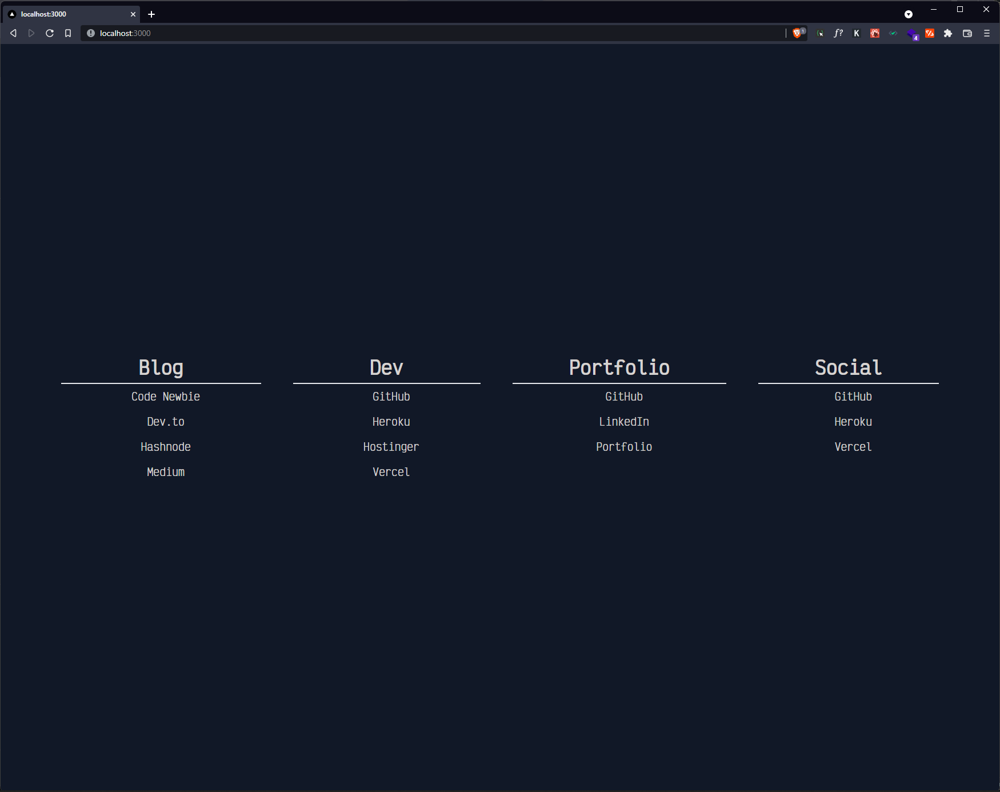

# About

<h1 align="center">
    <a href="https://startpage-7x8vyc009-somdobomk.vercel.app/" target="_blank">
     View Demo
    </a>
</h1>
<div align="center">
    
</div>

This is a [Next.js](https://nextjs.org/) project bootstrapped with [`create-next-app --typescript`](https://github.com/vercel/next.js/tree/canary/packages/create-next-app) and uses [TailwindCSS](https://tailwindcss.com/) for styling.

## Getting Started

First, clone the repository:

```bash
git clone https://github.com/Somdobomk/nextjs-startpage.git
cd nextjs-startpage
```

Then install dependencies:

```bash
npm install
```

Run the development server:

```bash
npm run dev
```

Open [http://localhost:3000](http://localhost:3000) with your browser to see the result.

You can start editing the page by modifying `pages/index.tsx`. The page auto-updates as you edit the file.

[API routes](https://nextjs.org/docs/api-routes/introduction) can be accessed on [http://localhost:3000/api/hello](http://localhost:3000/api/hello). This endpoint can be edited in `pages/api/hello.ts`.

The `pages/api` directory is mapped to `/api/*`. Files in this directory are treated as [API routes](https://nextjs.org/docs/api-routes/introduction) instead of React pages.

## Learn More

To learn more about Next.js, take a look at the following resources:

- [Next.js Documentation](https://nextjs.org/docs) - learn about Next.js features and API.
- [Learn Next.js](https://nextjs.org/learn) - an interactive Next.js tutorial.

You can check out [the Next.js GitHub repository](https://github.com/vercel/next.js/) - your feedback and contributions are welcome!

To learn more about Typescript, take a look at the following resources:

- [Typescript Documentation](https://www.typescriptlang.org/docs/) - learn about Typescript features and API.

You can check out [the Typescript GitHub repository](https://github.com/microsoft/TypeScript/) - your feedback and contributions are welcome!

To learn more about Tailwindcss, take a look at the following resources:

- [Tailwindcss Documentation](https://tailwindcss.com/docs/) - learn about Tailwindcss features and API.

You can check out [the Tailwind CSS GitHub repository](https://github.com/tailwindlabs/tailwindcss) - your feedback and contributions are welcome!

## Deploy on Vercel

The easiest way to deploy your Next.js app is to use the [Vercel Platform](https://vercel.com/new?utm_medium=default-template&filter=next.js&utm_source=create-next-app&utm_campaign=create-next-app-readme) from the creators of Next.js.

Check out our [Next.js deployment documentation](https://nextjs.org/docs/deployment) for more details.
